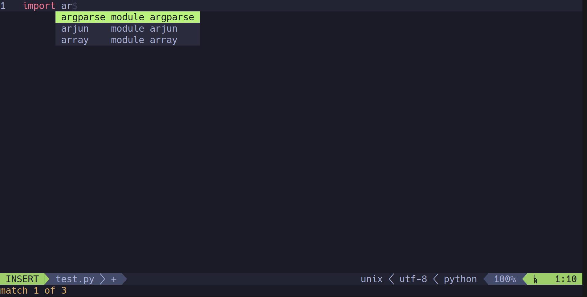

# Kunvim is my nvim configuration installer

## INSTALLATION
```
git clone https://github.com/root-tanishq/kunvim
cd kunvim 
bash install.sh
```



## Keybindings I use
| Key | What it does |
| --- | --- |
| Ctrl + Left arrow key | previous tab |
| Ctrl + Right arrow key | next tab |
| Ctrl + Up arrow key | Split horizontally |
| Ctrl + Down arrow key | Split vertically |
| Ctrl + t | Create a new tab | 
| Ctrl + q | exit vim | 
| Ctrl + s | Save file | 
| space | next buffer | 
| backspace | previous buffer |
| Ctrl + f | fzf for file opening |
| Ctrl + x | Open a mini terminal | 
| Ctrl + space | Python auto completion | 
| Ctrl + [ | Normal Mode |
| Ctrl + p | auto completion from file |
